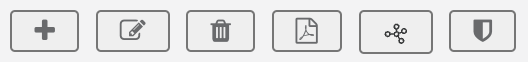
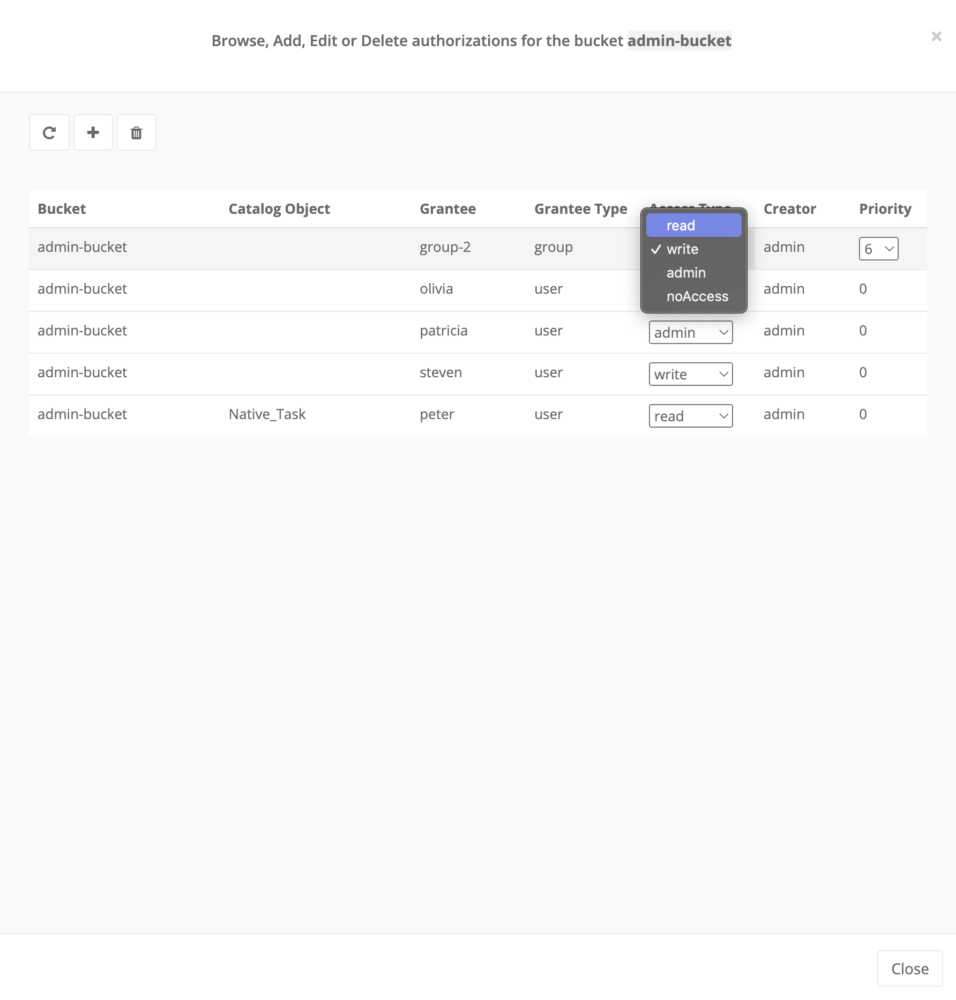

The *ProActive Catalog* is a component responsible for storing various objects of *ProActive Workflows and Scheduling* and in particular *ProActive Workflows*.

The ProActive Catalog features:

 * +++a <a class="catalogRestUrl" href="/catalog" target="_blank">REST API</a>.+++
 * +++a comprehensive <a class="automationDashboardUrl" href="/automation-dashboard/#/portal/catalog-portal" target="_blank">Catalog Portal</a>.+++

ProActive Catalog is organized into *buckets*.
Each bucket has a unique name and stores zero, one or more versioned ProActive Objects.

By default, ProActive objects are persisted on disk using the embedded HSQL database.
The data is located in `PROACTIVE_HOME/data/db/catalog`.

The Catalog web service binaries are stored in `PROACTIVE_HOME/dist/war/catalog`.
This directory contains a configuration file located in `PROACTIVE_HOME/dist/war/catalog/WEB-INF/classes/application.properties`.

More information regarding the Catalog configuration can be found in the <<../admin/ProActiveAdminGuide.adoc#_catalog_properties,catalog properties>> section.

A complete documentation of the Catalog REST API is available on the following +++<a class="catalogRestUrl" href="/catalog" target="_blank">link</a>+++.

This documentation is automatically generated using https://swagger.io[Swagger^].

==== Catalog security and groups management

The Catalog authenticates REST request using a *sessionID* header.
This sessionID is used to share session information between various ProActive Workflows & Scheduling microservices and is returned when authenticating to +++a <a class="restUrl" href="/rest" target="_blank">ProActive Scheduler REST API</a>.+++.

Every request to the Catalog must have a valid sessionID inside the request header to authenticate the user.
A role-based access control mechanism can also be defined on catalog buckets.
When creating a bucket, it can either be made *public* or restrained to a specific *group*.

Creating users and groups at the ProActive Scheduler level is explained in the <<../admin/ProActiveAdminGuide.adoc#_user_authentication,User Authentication>> section.

A _public_ bucket is automatically assigned to the *public-objects* group.

For example, a user which is part of the _interns_ group (GROUP:interns) can see and change buckets and their contents which belong to GROUP:interns.
This user can only access to the following buckets list:

  * All buckets that the user created.
  * All buckets belonging to the _interns_ group (GROUP:interns).
  * All _public_ buckets (GROUP:public-objects).

==== Catalog RBAC management

RBAC, or Role Based Access Control, represents a control model for a system in which each access decision is based on the role to which the user is associated.
In the catalog, two RBAC operations can be distinguished which are only performed by admins or bucket owners:

    1. Managing an authorization for a bucket
    2. Managing an authorization for a specific object in a bucket

Both bucket and object authorizations can be assigned for a specific user (using her/his username) and can be assigned for a user group (that contains multiple users).
Consequently, only one authorization can be created for a username or a user group.
However, the user can eventually have multiple authorizations due to a mix of username and user-group related authorizations for a bucket or an object.
Furthermore, the created authorizations can be modified or deleted.

An authorization can have one of the following access types:

* Read: The user or user group can only read the bucket and its objects (in case of a bucket authorization) or the object only (in case of a catalog-object authorization) and execute it.
* Write: The user or user group have, in addition to the read right, the privilege to add new objects in the bucket and to modify or delete one or many.
* Admin: The user or user group have, in addition to the write rights, the ability to modify a bucket (e.g. change the group) or delete a bucket.
Moreover, they can create, modify or delete the authorizations of other users for the bucket or its objects.
However, if it is a catalog-object authorization, in addition to the write rights, the user or group of users can create, modify or delete the authorizations of other users.
* No Access: The user or group of users have no access to the bucket and its objects (in case of a bucket authorization) or to a specific object (in case of a catalog-object authorization).

To manage the authorizations, there is a dedicated authorization view for each bucket that is accessible by clicking on the shield-like button above the buckets' list, as shown in the figure below.

The same is also available for an object.
Moreover, when you select an object, the authorization view button will appear above the objects of the selected bucket (the middle view of the portal).
The figure below shows the icon location.

Once you click on it (bucket or object authorization view button), the authorization view will open.
The figure belows shows the authorization view when the admin has clicked on the authorization view of a bucket.

image::../images/AuthorizationView.png[align=center]

The authorization view consists in two parts:

    * First, there are three buttons that allow the admin to refresh the authorizations list, add a new authorization and delete an existing one
    * Second, under the buttons, there is the list that shows the authorizations that are assigned to the current bucket.
In the case of a bucket authorization view, the list shows the authorizations created for the bucket and all of its objects.
However, in the case when the admin click on the authorization view button above the selected object, the list will show only the authorizations created for the selected object.
The figure below shows an example.

Each authorization has the following properties:

* Bucket Name
* Catalog Object (optional): If this attribute is empty, the authorization is automatically considered for the bucket. However, if the admin specifies an object name, the access is created for the specified object.
* Grantee Type: Group or user
* Grantee (required): the username or the user group name
* Access Type: read, write, admin or no access
* Priority: This attribute is only used for access associated with a group. Thus, if the user belongs to 2 groups, each of which has a different type of access, the system will choose the access with the highest priority for these users.

To create a new authorization, the admin just needs to click on the "+" button.
Then the view of creating authorization (as shown in the figure below) will be popped up.
The admin needs to fill in the authorization attributes (as presented above), then click the "Add authorization" button.
The figure below shows an example of an authorization which authorize the user named `olivia` the `write` access to the bucket `admin-bucket`.

Once the admin has created an authorization, it will appear in the authorizations list in the authorization view, as shown in the figure below.

To delete an authorization, the admin simply needs to select one from the list and the delete button will be activated.
It is the button with a "bin" symbol next to the add a new authorization button "+".
The figure below shows an example.

image::../images/DeleteGrant.png[align=center]

Once the admin delete the authorization, it will be removed from the list as shown in the figure below.

To update an authorization, the admin needs to click on the drop-down list of the access type or the priority level and select a new value.
The figure below shows an example.

Once the selection is made the authorization will be updated as shown in the figure below.

In the case where a user has multiple authorizations over a bucket, due to his username or user group(s) authorizations, the resulting access type will be calculated as follows:

* If the username-assigned authorization exists, it is prioritized and its access type will be the user's resulting rights over the bucket.

* If multiple user-groups authorizations exist, without a username authorization, the resulting user's rights over the bucket will be the access type of the group authorization that have the highest priority.

In the case where a user has multiple authorizations over an object, the resulting access type will be calculated as follows:

* If the username-assigned authorization for the object exists, it is prioritized and its access type will be the user's resulting rights over the object.

* If multiple user-groups authorizations exist for the object, without a username authorization, the resulting user's rights over the object will be the access type of the group authorization that have the highest priority.

* If both username-assigned authorization and user-groups authorizations do not exist for the object, the resulting user's rights for the object will be th same as the user's resulting rights over the bucket that contains the object.