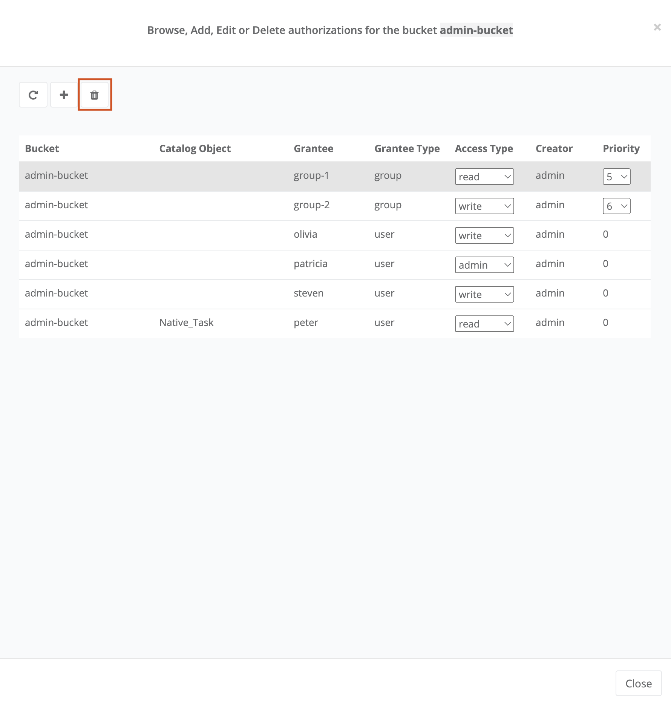

The *ProActive Catalog* is a component responsible for storing various objects of *ProActive Workflows and Scheduling* and in particular *ProActive Workflows*.

The ProActive Catalog features:

 * +++a <a class="catalogRestUrl" href="/catalog" target="_blank">REST API</a>.+++
 * +++a comprehensive <a class="automationDashboardUrl" href="/automation-dashboard/#/portal/catalog-portal" target="_blank">Catalog Portal</a>.+++

ProActive Catalog is organized into *buckets*.
Each bucket has a unique name and stores zero, one or more versioned ProActive Objects.

By default, ProActive objects are persisted on disk using the embedded HSQL database.
The data is located in `PROACTIVE_HOME/data/db/catalog`.

The Catalog web service binaries are stored in `PROACTIVE_HOME/dist/war/catalog`.
This directory contains a configuration file located in `PROACTIVE_HOME/dist/war/catalog/WEB-INF/classes/application.properties`.

More information regarding the Catalog configuration can be found in the <<../admin/ProActiveAdminGuide.adoc#_catalog_properties,catalog properties>> section.

A complete documentation of the Catalog REST API is available on the following +++<a class="catalogRestUrl" href="/catalog" target="_blank">link</a>+++.

This documentation is automatically generated using https://swagger.io[Swagger^].

==== Catalog security and groups management

The Catalog authenticates REST request using a *sessionID* header.
This sessionID is used to share session information between various ProActive Workflows & Scheduling microservices and is returned when authenticating to +++a <a class="restUrl" href="/rest" target="_blank">ProActive Scheduler REST API</a>.+++.

Every request to the Catalog must have a valid sessionID inside the request header to authenticate the user.
A role-based access control mechanism can also be defined on catalog buckets.
When creating a bucket, it can either be made *public* or restrained to a specific *group*.

Creating users and groups at the ProActive Scheduler level is explained in the <<../admin/ProActiveAdminGuide.adoc#_user_authentication,User Authentication>> section.

A _public_ bucket is automatically assigned to the *public-objects* group.

For example, a user which is part of the _interns_ group (GROUP:interns) can see and change buckets and their contents which belong to GROUP:interns.
This user can only access to the following buckets list:

  * All buckets that the user created.
  * All buckets belonging to the _interns_ group (GROUP:interns).
  * All _public_ buckets (GROUP:public-objects).

==== Catalog RBAC management

RBAC, or Role Based Access Control, represents a control model for a system in which each access decision is based on the role to which the user is associated.
In the Catalog, two RBAC operations can be distinguished:

    1. Managing a user or user group access grants for a Bucket
    2. Managing a user or user group access grants for a specific catalog object in a bucket

Regarding bucket-related RBAC operation, the following can be performed:

    * Assign a Grant for a user or group of users to a Bucket
    * Modify a Grant for a user or group of users to a Bucket
    * Delete a Grant for a user or group of users to a Bucket

Regarding catalog-object-related RBAC operation, the following can be performed:

    * Assign a Grant for a user or group of users to a Job in the Bucket
    * Modify a grant for a user or group of users to a job in the Bucket
    * Delete a grant for a user or group of users to a job in the Bucket

To manage your grants, there is a dedicated authorization view for each bucket that is accessible by clicking on the shield-like button above the buckets' list, as shown in the figure below.

image::../images/OpenAuthorizationView.png[align=center]

The same is also available for an object.
Moreover, when you select an object, the authorization view button will appear above the catalog objects of the selected bucket (the middle view of the portal).
Once you click on it (bucket or catalog object authorization view button), the authorization view will open, as shown in the figure below.

The authorization view consists in two parts:

    * First, there are three buttons that allow the admin to refresh the grants list, add a new grant and delete an existing grant
    * Second, under the buttons, there is the list that shows the grants that are assigned to the current bucket

To create a new grant, the admin needs to click on the "+" button.
Then another view, as shown in the figure below, will open that allows her/him to create a grant.

The figure above shows the interface that allows users to create a Grant for a Bucket or a Bucket job for other users or groups.
Thus, to create a Grant the user must provide the following elements:

    * Bucket Name
    * Catalog Object (optional): If this attribute is empty, the access is automatically considered for a Bucket only. However, if the user specifies a job name, the access is created for a Job.
    * Grantee Type: Group or user
    * Grantee (required): Name of the user or group
    * Access Type: read, write, admin or no access
    * Priority: This attribute is only used for access associated with a group. Thus, if the user belongs to 2 groups, each of which has a different type of access, the system will choose the access with the highest priority for these users.

Once the admin has completed filling the required attributes, the "Add authorization" button will be enabled, therefore, the admin ca create the grant.
The figure below shows an example.

image::../images/CreateAuthorization.png[align=center]

As mentioned above, the grant access type can have four different forms.
Below you may find the detailed explanation of each one:

    * Read: The user or user group can only read the bucket and its jobs (in case of a bucket grant) or the catalog object only (in case of a catalog-object grant) and execute it
    * Write: The user or user group have, in addition to the read right, the privilege to add new catalog objects in the bucket and to modify or delete one or many.
    * Admin: The user or user group have, in addition to the write rights, the ability to modify a bucket (e.g. change the group), delete a Bucket.
Moreover, they can create, modify or delete Grants for other users for the bucket or the catalog objects.
However, if it is a catalog object grant, in addition to the write rights, the user or group of users can create, modify or delete Grants to other users.
    * No Access: The user or group of users have no access to the bucket and its catalog objects (in case of a bucket grant) or to a specific catalog object (in case of a catalog object grant).

Once the admin has created a grant, it will appear in the grants list in the authorization view.
The figure below shows an example where the list of grants contains one grant created by the admin.

image::../images/ListOfGrants.png[align=center]

The grants can be easily updated by either changing the access type of it or changing the priority level of it (only if it is a bucket or catalog object group grant).
To update a grant, the admin needs to click on the drop-down list of the access type or the priority level and select a new value.

To delete a grant, the admin simply needs to select a grant from the list and the delete button will be activated.
It is the button with a "bin" symbol next to the add a new grant button "+".
The figure below shows an example.

Once the admin delete the grant, it will be removed from the list.